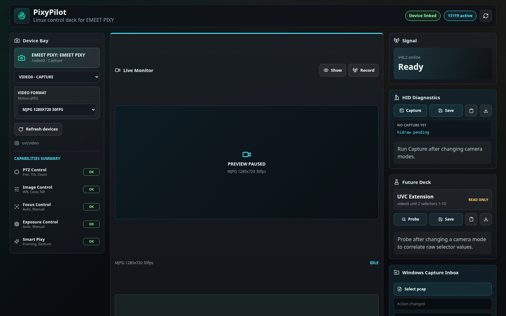
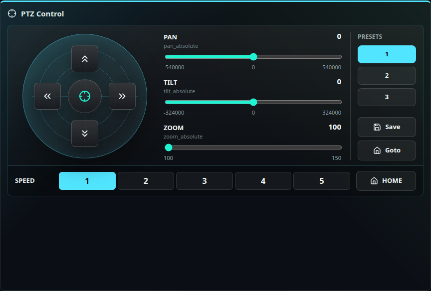
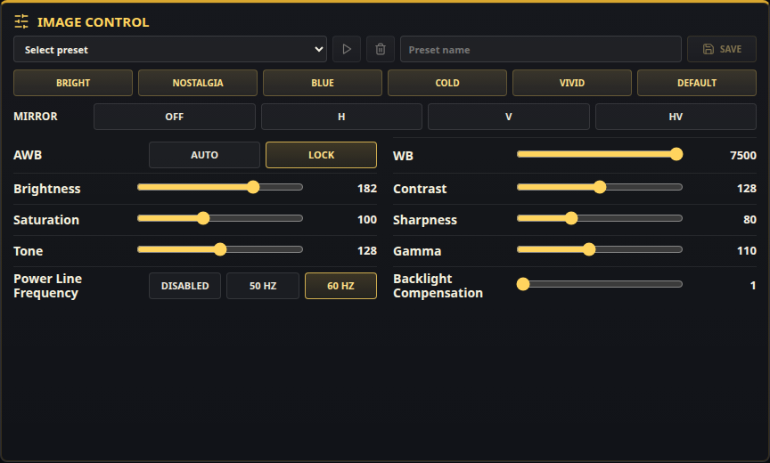

# PixyPilot

PixyPilot is an open-source Linux control deck for the EMEET PIXY AI PTZ camera.

It provides a Linux alternative to EMEET Studio and supports Ubuntu 24.04+, PTZ controls, camera presets, AI tracking controls, video preview, recording, native V4L2/HID integration, UVC extension diagnostics, and Windows USBPcap capture import for reverse engineering.

Keywords: EMEET PIXY Linux, EMEET PIXY Ubuntu, PTZ camera control, EMEET Studio alternative, Linux webcam control, Home Assistant PTZ camera, Home Assistant webcam control.

## Screenshots







The current implementation focuses on confirmed Linux control paths:

- enumerate camera devices
- enumerate V4L2 controls
- enumerate V4L2 video formats
- expose controls as JSON
- validate controls and set values through native V4L2 ioctls
- switch video formats through native V4L2 ioctls
- preview the selected camera stream
- record the selected stream to local disk
- detect Linux video/HID hotplug events and refresh the UI when the camera is connected or removed
- save HID and UVC diagnostic snapshots for correlation work
- import Windows USBPcap `.pcap` / `.pcapng` captures with action notes and sidecar metadata
- render a cockpit-style React UI for PTZ, image, focus, and exposure controls

The vendor-specific Pixy HID path is isolated in its own provider and now covers the decoded smart controls, directional/vector PTZ movement, mirror/rotate, focus metering, and native PTZ preset save/load. Raw UVC extension-unit capabilities are tracked in `PIXY_NOTES.md` and remain read-only until their selectors are decoded safely.

Windows USBPcap files can be uploaded through the `Windows Capture Inbox` panel when PixyPilot is reachable from the Windows machine on the local network. Uploaded captures are stored under `pcaps/imports/` with sidecar metadata for correlation work.

Reverse-engineering findings for other Linux users are collected in [docs/EMEET_PIXY_REVERSE_ENGINEERING.md](docs/EMEET_PIXY_REVERSE_ENGINEERING.md). The packet-capture index, HID report layouts, and confirmed command catalog are in [docs/EMEET_PIXY_HID_REFERENCE.md](docs/EMEET_PIXY_HID_REFERENCE.md). The UVC extension-unit workflow is documented in [docs/UVC_EXTENSION_CORRELATION.md](docs/UVC_EXTENSION_CORRELATION.md). The Home Assistant integration plan is in [docs/HOME_ASSISTANT.md](docs/HOME_ASSISTANT.md), the tray app notes are in [docs/TRAY_APP.md](docs/TRAY_APP.md), and future ideas are tracked in [docs/ROADMAP.md](docs/ROADMAP.md).

## Attribution

PixyPilot builds on the public EMEET PIXY reverse-engineering work published by `rm1138`:

- https://gist.github.com/rm1138/ef132c3a39f3c1effabf6354e2eca965

That work was the only public Linux-focused EMEET PIXY control reference we found early in the project, and it helped identify the device's useful control paths and HID report shape.

PixyPilot has also been cross-checked against `LarsArtmann/emeet-pixyd`:

- https://github.com/LarsArtmann/emeet-pixyd

That project independently confirms the same core tracking/privacy, gesture, and audio HID command families. It also helped validate the usefulness of read-only HID state queries and longer config-to-commit timing for some HID commands. PixyPilot's current implementation also includes additional local testing, packet captures from EMEET Studio, native V4L2 ioctl work, and UI/application code developed in this repository.

PixyPilot has also been cross-checked against `RoseWaveStudio/PixyBar`:

- https://github.com/RoseWaveStudio/PixyBar

That project is a native macOS menu-bar controller and `pixyctl` HID helper. It helped confirm target-tracking modes, degree-based PTZ move/recenter commands, response group masking, and the practical note that AI tracking visibly follows only while another app has the video stream open.

PixyPilot has also been cross-checked against `nick0413/Emeet_pixy_for_linux`:

- https://github.com/nick0413/Emeet_pixy_for_linux

That project independently confirms the standard V4L2 plus vendor HID split. It does not decode additional UVC extension selectors, but its UI reinforces that dependent controls such as exposure, white balance, and focus need obvious auto/manual unlock actions.

## Run The App

```bash
./tools/run-pixypilot.sh
```

Open `http://127.0.0.1:8000`.

This is the normal user mode: one command and one local address. The first run creates `backend/.venv`, installs backend dependencies, installs frontend packages, and builds the UI. FastAPI then serves both the API and the React app from the same port.

## Configuration

Regular users should edit `config/pixypilot.yaml`.

```bash
server:
  host: 127.0.0.1
  port: 8000

storage:
  presets: config/presets.yaml
  recordings: recordings

safety:
  start_in_privacy: true
```

The app also shows the active config file, storage paths, and local URL in the Runtime Config panel. Host and port changes require restarting PixyPilot. More details are in [docs/CONFIGURATION.md](docs/CONFIGURATION.md).

To upload packet captures directly from Windows, bind PixyPilot to your LAN address:

```yaml
server:
  host: 0.0.0.0
  port: 8000
```

Then open `http://<linux-machine-ip>:8000` from Windows and use the `Windows Capture Inbox` panel. Keep this LAN-only until authentication exists.

## Developer Mode

Developer mode is only for frontend hot reload while working on PixyPilot itself. Normal users do not need this.

Terminal 1:

```bash
cd backend
python3 -m venv .venv
source .venv/bin/activate
pip install -e ".[dev]"
pixypilot-api
```

Terminal 2:

```bash
cd frontend
npm install
npm run dev
```

Open `http://127.0.0.1:5173` for the Vite hot-reload UI. It proxies API requests to `http://127.0.0.1:8000`.

Standard V4L2 device inspection, control enumeration, format enumeration, control writes, and format switching use native Linux V4L2 ioctls. MJPG live preview also uses native V4L2 mmap capture.

## Control Presets

Image, focus, and exposure panels can save named local presets. Presets are stored in `config/presets.yaml`, which is ignored by git because those values are user/workspace specific.

Set a different preset file in `config/pixypilot.yaml` under `storage.presets`.

## Video Preview And Recording

PixyPilot streams live monitor frames through the backend as MJPEG.

- MJPG preview uses native V4L2 mmap capture and does not shell out to `ffmpeg`.
- Non-MJPG preview, such as YUYV, still falls back to `ffmpeg` because those raw frames need JPEG encoding for the browser stream.
- Recording still uses `ffmpeg` and writes files under `recordings/` by default.

The `recordings/` directory is ignored by git because camera recordings are large and private.

Set a different recording directory in `config/pixypilot.yaml` under `storage.recordings`.

## HID Permissions

PixyPilot needs write access to the PIXY hidraw node before experimental smart controls can work. Install the included udev rule once:

```bash
sudo install -m 0644 deploy/udev/70-pixypilot-hid.rules /etc/udev/rules.d/70-pixypilot-hid.rules
sudo udevadm control --reload-rules
sudo udevadm trigger --subsystem-match=hidraw
```

If the current `/dev/hidrawN` node does not update immediately, unplug and reconnect the camera. A working node should look like `root plugdev` with `crw-rw----`, and `/api/pixy-hid/status` should report `readable: true` and `writable: true`.

## Tests

```bash
cd backend
source .venv/bin/activate
pytest

cd frontend
npm test
```
